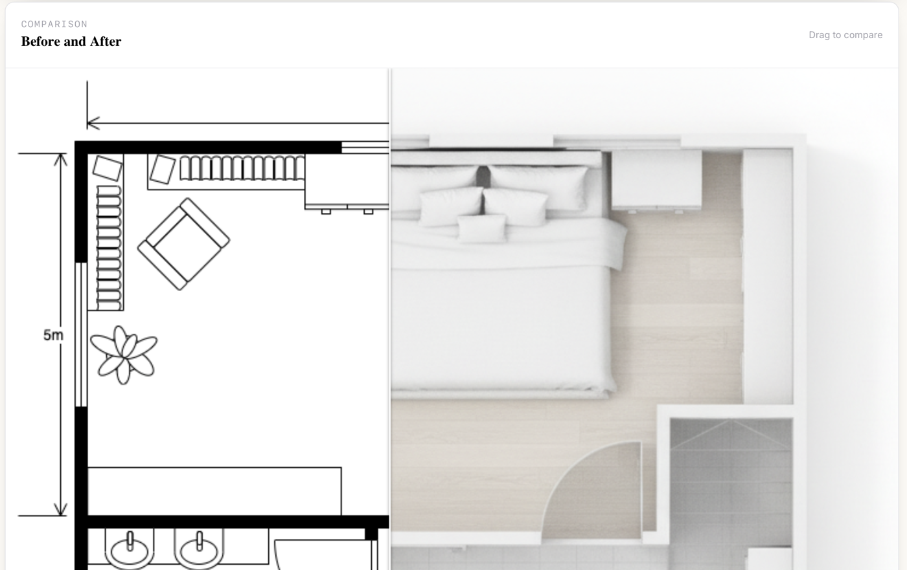
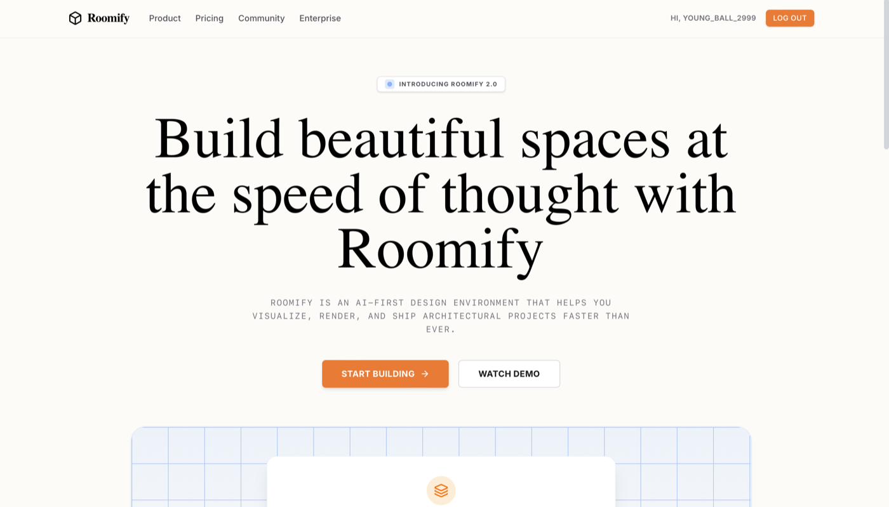
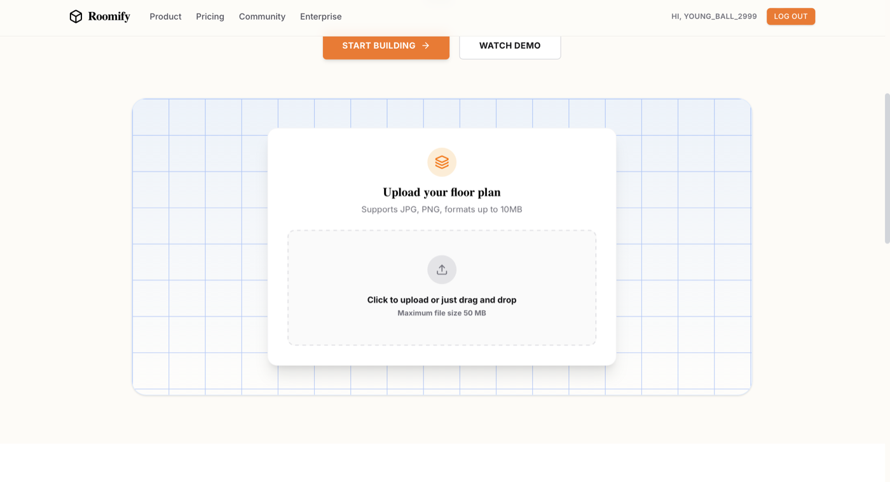
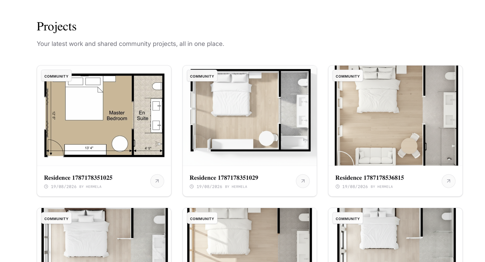

# Roomify

**AI-powered architectural visualization** — upload a 2D floor plan, get back a photorealistic 3D top-down render in seconds. Built with React, TypeScript, and a fully serverless backend.



## Overview

Roomify turns a flat 2D floor plan sketch into a photorealistic 3D architectural render using AI, then lets you compare the original and rendered versions side by side with an interactive slider. Every project is saved to the signed-in user's account and shown in a public community feed.

## Features

- **AI 2D-to-3D rendering** — converts an uploaded floor plan into a top-down photorealistic render using Google's Gemini image model.
- **Before/after comparison** — drag-to-compare slider between the source sketch and the rendered output.
- **Puter authentication** — sign in with a Puter account, no separate signup flow or password to manage.
- **Persistent project history** — every upload and render is saved and reloadable by project ID.
- **Permanent media hosting** — source images and renders get public, permanent URLs.
- **Community feed** — a shared gallery of public projects on the homepage.
- **Export** — download any rendered image directly from the editor.

## Screenshots

| Landing page | Upload flow |
|---|---|
|  |  |



## Tech Stack

| Layer | Technology |
|---|---|
| Frontend | React 19, TypeScript, React Router (SSR) |
| Styling | Tailwind CSS |
| Build tooling | Vite |
| Backend | [Puter](https://puter.com) — serverless Workers, key-value storage, file hosting |
| AI | Gemini (image generation) via Puter's hosted AI models |
| Auth | Puter accounts (Puter.js SDK) |

## Architecture Notes

This project has **no backend server or database of its own**. Persistence, file hosting, authentication, and AI inference are all handled by [Puter](https://puter.com), an open-source "Internet OS" platform:

- A small serverless [Puter Worker](lib/puter.worker.js) exposes a save/list/get API backed by Puter's key-value store — no server to provision or maintain.
- Uploaded images and renders are written to Puter's file storage and served from permanent public URLs.
- AI generation runs on Puter's **User-Pays model**: each signed-in visitor's own Puter account covers the cost of their AI usage, so hosting this app doesn't carry a per-request API bill for the developer.

## Getting Started

### Prerequisites

- [Node.js](https://nodejs.org/) and npm
- A free [Puter](https://puter.com) account

### Installation

```bash
git clone https://github.com/Hermela007/roomify.git
cd roomify
npm install
```

### Environment Variables

Create a `.env.local` file in the project root:

```env
VITE_PUTER_WORKER_URL=https://your-worker-name.puter.work
```

This URL comes from deploying `lib/puter.worker.js` as a Puter Worker (via `puter.workers.create`, either through Puter's desktop UI or the SDK).

### Development

```bash
npm run dev
```

Visit `http://localhost:5173`.

### Production Build

```bash
npm run build
npm run start
```

Or with Docker:

```bash
docker build -t roomify .
docker run -p 3000:3000 roomify
```

## Project Structure

```
app/routes/         # Pages (home, visualizer)
components/          # UI components (Upload, Navbar, buttons)
lib/
  puter.action.ts    # Auth + project CRUD (calls the deployed Worker)
  puter.hosting.ts   # Image upload to Puter's permanent file hosting
  puter.worker.js    # Serverless Worker: save/list/get projects in KV
  ai.action.ts        # AI render generation via Puter's hosted Gemini model
```

## Acknowledgements

Built by following [JavaScript Mastery](https://www.youtube.com/@javascriptmastery)'s Roomify tutorial as a learning project, then extended and debugged independently — including fixing several bugs in the reference implementation, resolving Git branch/history issues, and diagnosing Vite/SSR caching problems along the way.
